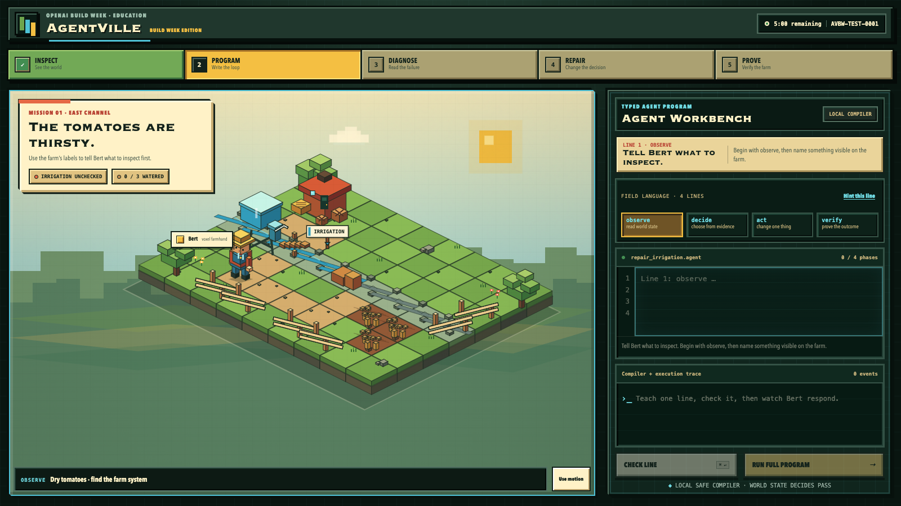

# AgentVille: Build Week Edition

**A five-minute voxel lesson about building agents that prove their work.**

AgentVille: Build Week Edition is a clean-room browser game for OpenAI Build Week's Education track. A player writes a tiny, safe agent program; compiles it into a visible plan; watches one farm agent named Bert execute it; discovers that valid syntax can still produce the wrong result; repairs one line; and receives a verification receipt derived from the changed farm. A final mission debrief translates the four commands into plain language and tells the player exactly what they accomplished.

**Play:** [b33fydan.github.io/agentville-build-week](https://b33fydan.github.io/agentville-build-week/) · **Source:** [github.com/b33fydan/agentville-build-week](https://github.com/b33fydan/agentville-build-week)



The whole lesson is one causal chain:

```text
observe the blocked channel
        ↓
decide what the evidence requires
        ↓
act on the cause, not the symptom
        ↓
verify the resulting world state
```

## Play locally

Requirements: Node.js 22 or newer.

```bash
npm install
npm run dev
```

Open [http://127.0.0.1:4173](http://127.0.0.1:4173). No account, API key, build tool, or runtime network request is required.

## The mission

The West Reservoir is full, but debris blocks the East Channel before water can reach three tomato beds. The Workbench teaches exactly four phases:

```agent
observe irrigation
decide if irrigation is blocked
act water tomatoes
verify tomatoes are watered
```

This first draft is valid and safe, but it fails honestly: watering cannot pass the obstruction. The compiler trace connects the failed verification to line 3. The player repairs only the causal action:

```agent
act clear blockage
```

Bert walks to the jam, clears it, water advances through the downstream channel, all three beds change to watered, and verification issues a receipt with before/after evidence. The closing debrief then explains the loop as **Look → Choose → Change → Check** and names the learner's work: they debugged an agent by using evidence to repair behavior.

## Why this teaches agents

Most coding lessons stop at “the program ran.” AgentVille separates five ideas a beginning builder can see:

1. **Syntax:** Is the program inside the safe language?
2. **Plan:** What will each instruction ask the agent to do?
3. **Execution:** What did Bert actually attempt?
4. **Diagnosis:** Why did the world remain unchanged?
5. **Verification:** Does the resulting farm satisfy the goal?
6. **Reflection:** What did each line contribute, and what did the learner just do?

The failure is not a game-over screen. It is the lesson: an agent can follow a valid plan that addresses a symptom instead of a cause.

## Safe language boundary

The Workbench is an allowlisted parser, not an embedded scripting engine. It accepts only four ordered lines and two possible actions for this bounded mission. It never calls `eval`, `Function`, a shell, the filesystem, or the network. Loops, comments, extra phases, JavaScript punctuation, browser globals, network primitives, and forged plans fail before world execution.

The compiler creates an immutable plan. The deterministic mission simulator is the only code allowed to mutate farm state. Canvas animation reflects that state; it cannot award a PASS.

## GPT-5.6 and Codex collaboration

This repository was created with Codex/GPT-5.6 as an engineering and curriculum collaborator on 2026-07-16. The collaboration produced:

- the bounded five-minute acceptance contract;
- the `observe → decide → act → verify` teaching language;
- line-specific compiler explanations and repair suggestions;
- the causal failure/repair script for Bert;
- a clean-room procedural voxel art direction;
- sandbox, determinism, browser, and evidence tests;
- the Devpost evidence and `/feedback` continuity contract.

The in-game **Codex Coach** uses a small set of deterministic, locally shipped explanations authored during that collaboration. There is intentionally no live model call in the mission-critical path. A judge or learner can always finish without credentials or connectivity, and a model can never invent a passing receipt. A future live-coaching seam may expand explanations, but the local compiler and world verifier must remain authoritative.

No code, assets, screenshots, or generated artifacts were copied from `/Volumes/beefybackup/AgentVille`. That older project was treated as reference-only and was not inspected for implementation material during this build. Every visible game asset in this repository is drawn procedurally with Canvas 2D and CSS.

## Architecture

```text
real textarea
    │
    ▼
src/compiler.js ── immutable allowlisted plan
    │
    ▼
src/mission.js  ── deterministic before/after evidence + receipt
    │
    ├── src/debrief.js ── truthful plain-language learning recap
    ├── src/app.js      ── lesson state, trace, feedback continuity
    └── src/world.js    ── procedural isometric farm presentation
```

- `src/compiler.js` — strict four-line compiler and safety diagnostics
- `src/mission.js` — pure mission transitions and world-state receipt
- `src/debrief.js` — immutable end-of-mission explanation derived from the receipt
- `src/world.js` — one procedural isometric farm, water, crops, debris, and Bert
- `src/app.js` — deterministic timeline, accessible Workbench, state hooks
- `feedback/` — session-preserving local feedback and JSON evidence export
- `tests/` — Node tests for the language and simulator
- `scripts/smoke-browser.mjs` — full production-browser mission validation
- `docs/ACCEPTANCE.md` — bounded automated and manual definition of done
- `docs/DEVPOST_EVIDENCE.md` — honest submission evidence ledger

## Validation

```bash
npm test              # compiler, sandbox, state transitions, receipts
npm run test:browser  # full typed draft → FAIL → repair → PASS flow
npm run test:public   # same full flow against the live Pages URL
npm run smoke         # unit tests + production build + browser flow
npm run capture       # refresh the canonical submission screenshots
```

The app also exposes two deterministic automation seams:

- `window.render_game_to_text()` returns the canonical visible/interactive mission state.
- `window.advanceTime(ms)` advances the animation at fixed 60 Hz steps.

The browser smoke rejects console/page errors, external requests, state/DOM disagreement, missing session continuity, and a false PASS. Machine-readable results are written to `artifacts/evidence/latest-smoke.json` for local production and `artifacts/evidence/latest-public-smoke.json` for the deployed build.

Current validation passes 26/26 Node tests, 117/117 browser assertions against local production `dist/`, and 117/117 against the public Pages deployment.

## Production build and deployment

```bash
npm run build
node scripts/serve.mjs --root=dist --port=4173
```

`dist/` is a static site. The canonical deployment is [GitHub Pages](https://b33fydan.github.io/agentville-build-week/), published from `main` by `.github/workflows/pages.yml`. Each push installs Chromium, runs `npm run smoke`, uploads `dist/`, and deploys only after validation passes. The first successful deployment was [Actions run 29554682024](https://github.com/b33fydan/agentville-build-week/actions/runs/29554682024) at commit `cb57621` on 2026-07-17.

The live root and `/feedback/` route return HTTP 200, and `npm run test:public` completes the deployed mission with 117/117 browser assertions. The learner-debrief release deployed successfully in [Actions run 29618190795](https://github.com/b33fydan/agentville-build-week/actions/runs/29618190795) at commit `8d2f0b5` on 2026-07-17. `vercel.json` and `netlify.toml` remain valid alternate-host declarations. No deployment path requires a server function or application secret.

## Submission evidence

The successful receipt ID is carried unchanged to:

```text
/feedback/?session_id=<receipt-session-id>
```

The feedback page displays that ID, matches it against the locally preserved receipt, and includes it unchanged in the downloadable JSON response. See [docs/DEVPOST_EVIDENCE.md](docs/DEVPOST_EVIDENCE.md) for the artifact ledger. Public deployment is proven; human playtests, the demo video, and any separate event-issued `/feedback` ID remain incomplete until genuine evidence exists.

## Scope

This edition is intentionally one mission, one farm, one agent, one failure, and one proof. It does not include free play, multiple agents, procedural worlds, accounts, arbitrary scripting, or a live AI dependency. Coherence is the feature.

## License

MIT. See [LICENSE](LICENSE).
