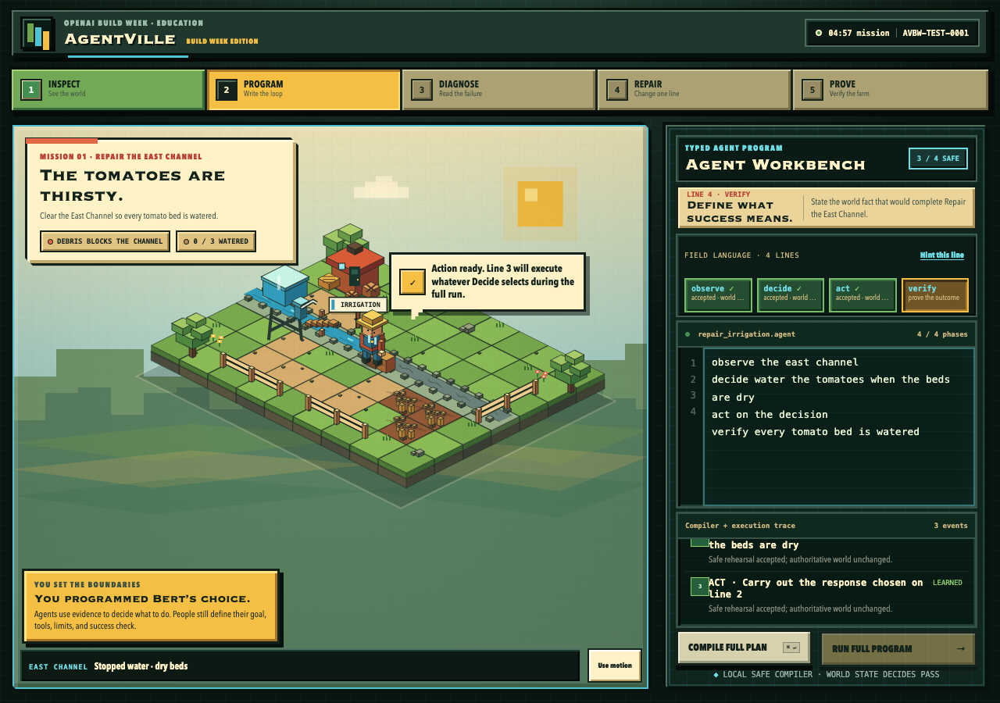

# AgentVille: Build Week Edition

**Three five-minute voxel lessons about building agents that prove their work.**

AgentVille: Build Week Edition is a clean-room browser learning game for OpenAI Build Week's Education track. The player teaches one humanoid voxel farmhand named Bert a tiny, safe program; watches each instruction become visible behavior on the farm; uses an honest failure as evidence; repairs exactly one line; and receives a verification receipt derived from the resulting world state.

The current worktree contains a complete three-mission course:

1. **Repair the East Channel** — distinguish a symptom from its cause.
2. **Storm Watch** — choose a signal that arrives before harm.
3. **The Hungry Hens** — observe the evidence a decision actually needs.

Each mission is designed as a compact five-minute loop. Together they teach that an agent is more than four keywords: it needs relevant evidence, a bounded choice, an authorized action, and a check against the real world.

**Public release:** [b33fydan.github.io/agentville-build-week](https://b33fydan.github.io/agentville-build-week/) · **Source:** [github.com/b33fydan/agentville-build-week](https://github.com/b33fydan/agentville-build-week)

> The three-mission worktree passes **58/58 Node tests** and **735/735 production-browser assertions** with empty diagnostics. All 15 current-release captures were visually inspected. Deployment and a fresh public smoke are still pending; the Pages URL currently proves the preceding release, not this three-mission course.



## Play locally

Requirements: Node.js 22 or newer.

```bash
npm install
npm run dev
```

Open [http://127.0.0.1:4173](http://127.0.0.1:4173). The game is static and local-first: no account, API key, backend, runtime model call, or runtime network request is required.

## The safe language

Every mission uses the same four-phase shape:

```text
observe the <subject>
decide <response> when <full condition clause>
act on the decision
verify <goal clause>
```

Commands are lowercase words and spaces only. The Workbench accepts only the exact commands registered for the active mission. Line 3 is intentionally identical in every lesson: Decide selects a response from scoped evidence, and `act on the decision` carries out that selection without choosing again.

The first three accepted lines create non-authoritative rehearsals so Bert can react while the learner builds the program. A rehearsal cannot mint an executable plan, mutate the world, advance its revision, or issue a receipt. Only the strict four-line compiler privately mints an immutable plan, and only the deterministic mission simulator may change state or award PASS.

## The three missions

### Mission 01 — Repair the East Channel

The farm begins with a blocked East Channel, three dry tomato beds, and an **IRRIGATION** sign that gives a novice the observation vocabulary without revealing the repair.

The guided program is valid and safe:

```agent
observe the east channel
decide water the tomatoes when the beds are dry
act on the decision
verify every tomato bed is watered
```

Observe reports stopped water, visible debris, and dry beds. Decide chooses direct watering because the beds are dry. Act faithfully carries out that response, but the blockage prevents water from reaching the beds. Verify reports FAIL and the Codex Coach identifies line 2 as the causal choice.

The learner repairs only Decide:

```agent
decide clear the blockage when the water is blocked
```

Bert clears the blockage, water travels downstream, all three tomato beds recover, and Verify issues the first PASS receipt.

### Mission 02 — Storm Watch

Passing Mission 01 unlocks a real second mission. The farm shows uncovered seedling beds, covers waiting beside the shed, storm clouds, and a **WEATHER** vane clue.

The guided program waits for a lagging signal:

```agent
observe the sky
decide cover the beds when rain falls
act on the decision
verify the seedlings are safe
```

Observe reports that clouds are gathering but rain has not started. The `rain falls` condition is supported by that observation and currently false, so Decide selects no response and Act makes no change. The simulator—not the presentation layer—then advances the fixed 60 Hz mission timeline. At tick 150 the scripted storm reaches the uncovered beds, and Verify honestly reports battered seedlings. The Coach explains that waiting for rain made the trigger arrive after the harm.

The learner repairs only Decide:

```agent
decide cover the beds when clouds gather
```

The leading signal is already true in the observed evidence, so Bert covers the beds before the same deterministic storm event and Verify proves the seedlings stayed safe.

### Mission 03 — The Hungry Hens

Passing Storm Watch unlocks the final lesson. The farm contains an empty tray, a full feeder with a jammed chute, three hungry hens, and a **FEEDER** clue sign.

The guided program looks in the wrong place:

```agent
observe the feeder
decide unjam the chute when the hens are hungry
act on the decision
verify every hen has eaten
```

Observe reports the full feeder and jammed chute, but it provides no evidence about whether the hens are hungry. Decide evaluates conditions only against the evidence minted by line 1—not against a hidden global snapshot. The condition is therefore **unsupported**, not false; no response is selected, no action runs, and Verify reports FAIL. The Coach points to line 1.

The learner repairs only Observe:

```agent
observe the hens
```

That observation reports hungry hens at the jammed chute. Decide can now use the required fact, Bert unjams the chute, grain drops, every hen eats, and Verify completes the course.

## Why this teaches agents

Most coding lessons stop when a program runs. AgentVille makes seven distinct ideas visible:

1. **Syntax:** Is the program inside the safe language?
2. **Observation scope:** Did the agent gather the evidence this decision needs?
3. **Decision:** Which bounded response does the evidence support?
4. **Action:** What response did Bert actually carry out?
5. **Events:** What deterministic world change happened around the agent?
6. **Verification:** Does the resulting farm satisfy the declared goal?
7. **Reflection:** What failed, what did the learner repair, and what does the proof show?

The three failures are deliberately different:

- Mission 01 observes enough evidence but chooses a symptom instead of the cause.
- Mission 02 observes the right subject but chooses a condition that is false until it is too late.
- Mission 03 chooses a sensible response whose condition is unsupported by the chosen observation.

That distinction is the curriculum. A false condition means the observation contains the relevant fact and it is currently false. An unsupported condition means the observation never established that fact at all.

## Mission registry and authority boundary

Mission content lives in `src/mission-registry.js`. Each immutable definition owns its:

- ID, name, order, objective, prerequisite, and unlock;
- initial state, normalization, snapshots, and snapshot key;
- exact allowlisted commands and Decide bindings;
- observation collectors and scoped fact records;
- condition evaluators, action transitions, and verification predicate;
- fixed-tick scripted events;
- Coach, debrief, UI, and voxel-world metadata.

The compiler, simulator, app, debrief, and course-progress reducer consume the active definition instead of branching across duplicated lesson data.

```text
real textarea
    │
    ▼
prefix validator ── safe rehearsal only; no world authority
    │
    ▼ all four lines
src/compiler.js ───────── compiler-minted, mission-bound plan
    │
    ▼
src/mission.js ────────── scoped Observe evidence → Decide → Act → events → Verify
    │
    ├── src/mission-registry.js ── immutable mission definitions
    ├── src/course-progress.js ─── ordered unlock state
    ├── src/debrief.js ─────────── receipt-derived learning recap
    ├── src/app.js ─────────────── fixed-tick teaching and execution UI
    └── src/world.js ───────────── procedural isometric presentation
```

The Workbench is an allowlisted parser, not an embedded scripting engine. It never calls `eval`, `Function`, a shell, the filesystem, or the network. Loops, comments, extra phases, JavaScript punctuation, browser globals, network primitives, unsupported commands, cloned plans, cross-mission plans, and inconsistent bindings fail closed.

The simulator privately mints observation and decision evidence for the exact compiled plan. Canvas animation consumes that evidence but cannot decide a verdict. The Codex Coach explains evidence but cannot mutate the farm or issue proof.

## Receipts, unlocks, and feedback

A PASS receipt unlocks only the next mission in registry order:

```text
repair-east-channel → storm-watch → hungry-hens
```

Every execution receipt uses schema `agentville.receipt.v2` and carries the `missionId` and `sessionId` together with the source program, before/after snapshots, observation scope, condition support/truth evidence, selected and executed action, scripted events, and verdict.

The feedback route carries the same composite identity:

```text
/feedback/?mission_id=<mission-id>&session_id=<receipt-session-id>
```

Feedback exports use `agentville.feedback.v2`. Browser storage is keyed by both mission and session, preventing one lesson's receipt or response from being mistaken for another.

## Voxel Field Rig

The interface uses one clean-room material language: a sunlit hand-built farm diorama mounted inside a square, beveled spruce-and-metal field console. Canvas 2D draws the terrain, water, buildings, fences, crops, props, clue signs, weather state, seedlings, feeder, hens, and Bert procedurally. No external game assets are downloaded.

Bert is built from rendered voxel anatomy rather than a mascot block: boots, legs, torso, overalls, arms, hands, head, face, hair, straw hat, and wrench. His silhouette changes for walking, inspection, thinking, repair, action, and verification. The renderer exposes descriptive geometry through `render_game_to_text()`, but that presentation evidence has no compiler or verifier authority.

The app preserves two deterministic automation seams:

- `window.render_game_to_text()` returns the canonical visible and interactive state.
- `window.advanceTime(ms)` advances the app in fixed 60 Hz steps.

## GPT-5.6 and Codex collaboration

Codex/GPT-5.6 has served as an engineering, curriculum, visual-design, and verification collaborator since 2026-07-16. Human direction defined the learning vision: let novices teach Bert progressively, make failure playful and causal, explain what the learner did, and turn the weather tease into a real sequence.

The collaboration produced the bounded acceptance contract, safe-language grammar, three distinct repair lessons, registry architecture, observation-scoped evidence model, deterministic storm timeline, line-specific Coach copy, Voxel Field Rig, browser evidence harness, Devpost narrative, and receipt-to-feedback continuity.

The shipped Coach is deterministic prose authored during that collaboration. There is intentionally no live GPT or OpenAI API call in the mission-critical path. A learner can always finish without credentials or connectivity, and a model can never invent a passing receipt.

## Validation

```bash
npm test              # compiler, registry, simulator, receipts, unlocks, feedback identity
npm run test:browser  # complete production browser course
npm run test:public   # same course against the live Pages URL
npm run smoke         # Node tests + production build + browser flow
npm run capture       # canonical submission screenshots
```

Current three-mission worktree evidence on 2026-07-20:

- **58/58 Node tests passed.**
- The production `dist/` browser smoke passed **735/735 assertions** with zero console, page, external-request, request-failure, response, dialog, or runner diagnostics.
- All **15/15** canonical three-mission captures were generated and visually inspected at desktop, judging, and mobile viewports.
- A local manual sequential Playwright run completed Mission 01 → Mission 02 → Mission 03.
- Direct renderer proof passed **16/16** checks.
- The provided generic web-game client completed successfully and its state/canvas output was inspected.
- Commit, public deployment, and a fresh public browser smoke are still pending. The release is not claimed public until those gates pass.

Generated smoke evidence belongs under `artifacts/evidence/`. Genuine human playtests, a demo video, and any separate event-issued `/feedback` session ID remain pending until those artifacts actually exist.

## Production build and deployment

```bash
npm run build
node scripts/serve.mjs --root=dist --port=4173
```

`dist/` is a static site. GitHub Pages publishes from `main` through `.github/workflows/pages.yml` only after the configured validation gate passes. No deployment path requires a server function, application secret, or runtime network dependency.

## Clean-room declaration

No code, assets, screenshots, or generated artifacts were copied or adapted from `/Volumes/beefybackup/AgentVille`. That repository remains reference-only. All implementation and visible game art in this repository were authored inside `/Volumes/beefybackup/agentville-build-week`; the visuals are procedural Canvas 2D and CSS.

## Scope

This edition is intentionally three playable missions on one compact farm, one agent named Bert, three distinct causal failures, one single-line repair per mission, and one mission-bound proof per success. It does not include free-play farming, multiple programmable agents, procedural worlds, accounts, arbitrary scripting, multiplayer, cloud saves, or a live AI dependency. Coherence remains the feature.

## License

MIT. See [LICENSE](LICENSE).
